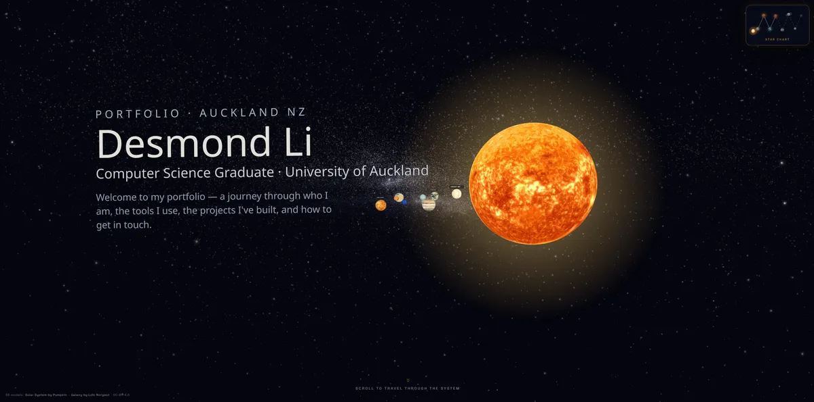

# Desmond Li — Portfolio

My personal portfolio, built as an interactive 3D journey through a solar system. Scrolling flies the camera from the sun out through the planets, and each planet is a section of the site — **About Me**, **Tech Stack**, **Projects**, and **Contact**. Click a planet to open its panel, or use the star chart in the corner to jump straight to any section.



> **Live site:** coming soon

## Features

- Scroll-driven camera travel with smooth docking at each planet
- Star chart mini-map that doubles as click-to-fly navigation
- Loading screen, WebGL fallback page, and `prefers-reduced-motion` support
- Tuned for performance — optimized assets (20 MB → 1 MB model) and no post-processing

## Tech stack

React · Vite · Three.js / React Three Fiber · Motion · Tailwind CSS

## Running locally

```bash
npm install
npm run dev
```

## Credits

3D models licensed [CC-BY-4.0](https://creativecommons.org/licenses/by/4.0/):
["Solar System Paint 3D"](https://sketchfab.com/3d-models/solar-system-paint-3d-fd0cb20fd0794d3886cbbc8cc86ff6c9) by [Pumpkin](https://sketchfab.com/savounited) · ["Need some space?"](https://sketchfab.com/3d-models/need-some-space-d6521362b37b48e3a82bce4911409303) by [Loïc Norgeot](https://sketchfab.com/norgeotloic)

## Contact

**Desmond Li** — Computer Science graduate at the University of Auckland, looking for software engineering internships and graduate roles.

[Email](mailto:lidesmond2323@gmail.com) · [LinkedIn](https://www.linkedin.com/in/desmond-li-aa1935321/) · [GitHub](https://github.com/desm2323)
